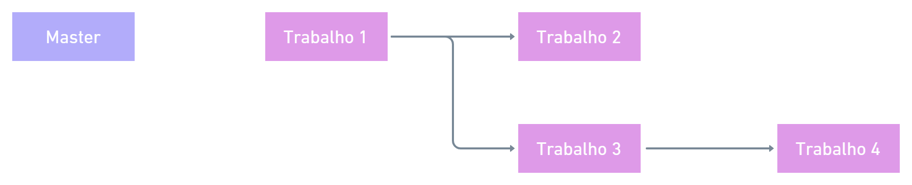

# Circuitos Elétricos 2 - DEL - UFRJ

### Branches

- [Trabalho 1 - Análise Nodal Simples](https://github.com/ricardossiqueira/circuitos-eletricos-2/tree/trabalho-1)

- [Trabalho 2 - Análise Nodal Simples no Regime Permanente Senoidal](https://github.com/ricardossiqueira/circuitos-eletricos-2/tree/trabalho-2)

- [Trabalho 3 - Análise Nodal Modificada](https://github.com/ricardossiqueira/circuitos-eletricos-2/tree/trabalho-3)

- [Trabalho 4 - Análise Nodal Modificada (Não Linear) no Domínio do Tempo com Newton-Raphson](https://github.com/ricardossiqueira/circuitos-eletricos-2/tree/trabalho-4)
